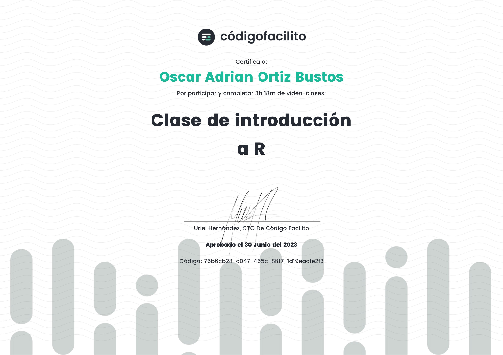
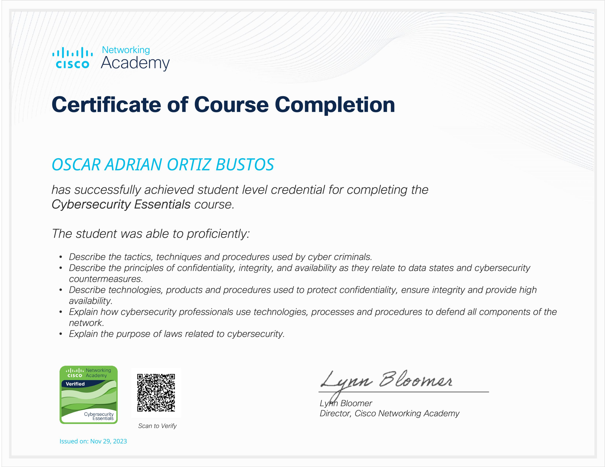
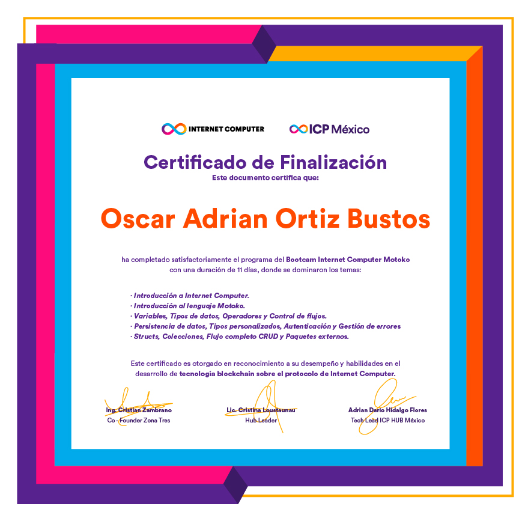
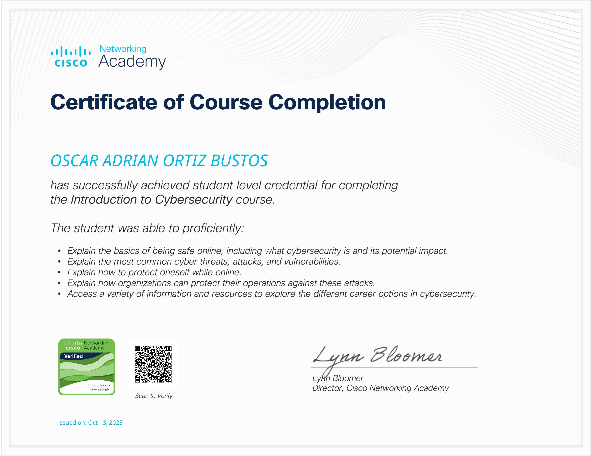

<h1 align="center">👋 Hi, I'm Adrian Ortiz</h1>
<h3 align="center">Web developer passionate about Open Source and continuous learning.</h3>

<table align="center">
  <tr>
    <td width="50%">
      <h3>🚀 About me</h3>
      <ul>
        <li>🌐 My web space: <a href="https://4drian0rtiz.github.io">https://4drian0rtiz.github.io</a></li>
        <li>📝 I write on my blog: <a href="https://neandertech.netlify.app/blog">The NeanderTech Cave</a></li>
        <li>📫 Contact: <b>arguortiz@icloud.com</b></li>
        <li>⚡ Fun fact: I consider myself <b>funny</b>.</li>
        <li>🐧 Linux and Open Source enthusiast.</li>
      </ul>
    </td>
    <td width="50%" align="center">
      
    </td>
  </tr>
</table>

---

### 🌟 Languages and tools

  
  
  
  
  
  
  
  
  
  
  
  
  
  
  
  
  
  

---

### 📊 Statistics

    
    

  

---

### 🌐 Find me on

  
  

---

### 📜 Certifications

  
  
  
  
  
  

